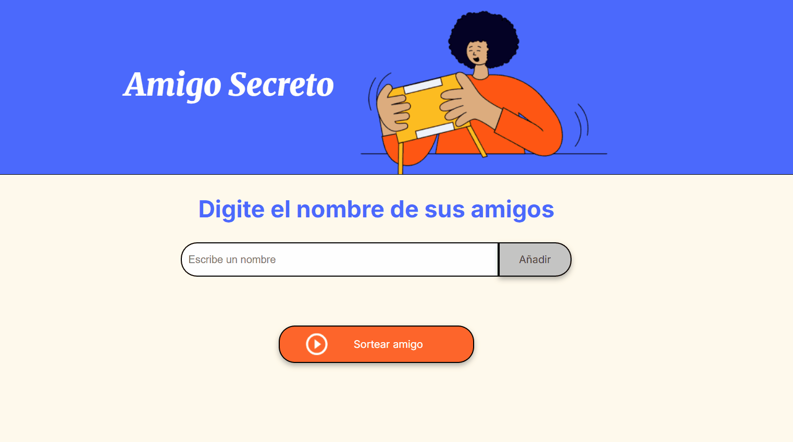

# 🎁 Amigo Secreto

Aplicación web interactiva para realizar sorteos de amigo secreto de forma rápida y facil. 
Perfecta para fiestas navideñas, cumpleaños o cualquier intercambio de regalos.

## 📸 Demo



## ✨ Características

- ✅ **Agregar participantes** - Añade nombres de forma dinamica a la lista
- 🔤 **Formato automatico** - Convierte nombres a formato título (Primera letra mayúscula)
- 🚫 **Validacion inteligente** - No permite campos vacíos ni números
- 🎲 **Sorteo aleatorio** - Selección completamente aleatoria del ganador
- 📱**Interfaz intuitiva** - Diseño limpio y facil de usar

## 🛠️ Tecnologias Utilizadas


### Detalles Tecnicos:
- **JavaScript Vainilla** - Sin dependencias externas
- **Manipulación del DOM** - Creación dianámica de elementos
- **Arrays y funciones** - Gestion eficiente de datos
- **Expresiones regulares** - Para validacion de entrada

## 🚀 Cómo Usar 

### Eejecutar localmente 
1. Clona este repositorio:
   ```bash
   git clone https://github.com/Zylium33/challenge-amigo-secreto.git
   ```
2. Navega al directorio del proyecto:
   ```bash
   cd challenge-amigo-secreto
   ```
3. Abre `index.html` en tu navegador favorito

### Instrucciones de uso:
1. 📝 Escribe el nombre de un participante
2. ➕ Haz clic en "Añadir" o presiona Enter
3. 🔁 Repite para todos los participantes (mínimo 2)
4. 🎲 Haz clic en "Sortear Amigo"
5. 🎉 ¡Listo! El ganador aparecerá en pantalla


## 💻 Estructura del Código

```javascript
// Principales funciones implementadas:

agregarAmigo()      // Añade participantes con validación
actualizarLista()   // Renderiza la lista visual
tieneNumero()       // Valida entrada de datos
sortearAmigo()      // Ejecuta el sorteo aleatorio
```

## 📚 Lo que Aprendí

Este proyecto me ayudó a consolidar conceptos fundamentales de JavaScript:

### 🎯 Conceptos Técnicos:
- **Manipulación de Arrays**: Uso de `push()` para gestionar listas dinámicas
- **DOM Manipulation**: Creación de elementos con `createElement()` y `appendChild()`
- **Event Handling**: Manejo de eventos de usuario (clicks, inputs)
- **Validación de Datos**: Implementación de expresiones regulares `/\d/.test()`
- **String Methods**: Trabajo con `charAt()`, `slice()`, `toUpperCase()`, `toLowerCase()`

## 🎓 Contexto del Proyecto

Este proyecto fue desarrollado como parte del programa Oracle ONE en Alura Latam.
- **Base proporcionada**: Estructura HTML y estilos CSS
- **Mi implementación**: Toda la lógica JavaScript y funcionalidades interactivas
- **Aprendizaje aplicado**: Manipulación del DOM, validaciones, y gestión de estados

## 🙏 Agradecimientos

- [Alura Latam](https://www.alura.com.br/) - Por la formación y proyecto base
- Programa Oracle ONE - Por la oportunidad de aprendizaje

## 🔮 Futuras Mejoras

### 🎮 Funcionalidad de Juego
- [ ] **Botón "Nuevo Sorteo"** - Reiniciar sin recargar la página
- [ ] **Sistema de rondas** - Evitar repetir ganadores en la misma sesión
- [ ] **Historial de ganadores** - Mostrar quién ha salido en sorteos anteriores

## 👨‍💻 Autor

**Jorge Bernal**

- GitHub: [@Zylium33](https://github.com/Zylium33)
- LinkedIn: [Jorge Bernal](https://www.linkedin.com/in/jorge-luis-bernal-saucedo-a58bb137a/)

---

**💻 Desarrollado por [Jorge Bernal] - Aprendiendo JavaScript con Oracle ONE + Alura**
